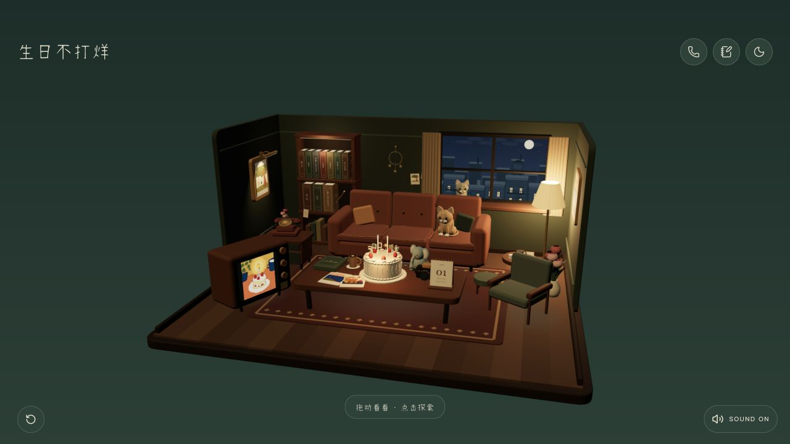

# 生日不打烊 · Birthday Stays Open

给一个重要的人，留一间随时可以回来的生日小屋。

这是一个可二创的 3D 生日网页：把照片、声音、书、电影、共同经历和一些只有你们懂的小事，变成房间里的物件与机关。来访者可以转动视角、改变天气、拨电话、翻照片、摸猫、寻找回忆，最后点亮蛋糕并许愿。

[在线体验](https://birthday-stays-open.vercel.app/) · [快速开始](#快速开始) · [二创指南](#为朋友做一间新的小屋) · [English](#english)



> 公开仓库是完整的脱敏版本：包含可运行源码、AI 涂鸦示例图和纯音乐实现，不包含原始私人照片、私人录音或商业歌曲。

## 这间房间如何讲故事

它不是一页从上到下阅读的电子贺卡，而是一段由探索推动的生日体验。

| 阶段 | 来访者看到什么 | 设计目的 |
| --- | --- | --- |
| 接到电话 | 第一次打开出现来电与简短留言；以后直接回房间，也可以主动回听 | 用一个熟悉的动作进入故事，避免每次重复完整开场 |
| 进入房间 | 可以在限定角度内转动视角、缩放并切换七种天气 | 先建立“这是为你留着的地方” |
| 探索物件 | 相框、书架、电话、电视、日历、抽屉、猫咪等各有反馈 | 把回忆拆成可以自己发现的小片段 |
| 收集回忆 | 尚未发现的类别保留悬念；发现五类不同回忆后解锁蛋糕 | 让浏览产生节奏和期待，而不是一次展示全部内容 |
| 许愿与亮灯 | 吹灭蜡烛后房间变暗，各个角落依次重新亮起，最后读到一封信 | 给体验一个安静而完整的收束 |

房间当前包含：

- 用 Three.js 搭建的程序化 3D 房间，桌椅、墙面、窗户、书架、猫和装饰主要由代码生成。
- 晴天、雨天、落雪、夕阳、蓝调、夜晚和烛光七套窗景、灯光与背景配色。
- 可拨动的电话、自动轮播的电视、可翻面的拍立得、翻页日历和聚焦镜头。
- 会独立眨眼的猫咪、郁金香、小象、抽屉星光等轻量动画与小机关。
- 首次来电、探索解锁、蛋糕许愿、逐步亮灯、生日信件的完整状态流程。
- 手机双指缩放、顶部宿主安全区、圆角界面、渲染预算和 WebGL 不可用时的简化入口。
- 纯前端本地存储：探索进度留在 localStorage，用户自己拍摄的照片留在 IndexedDB。

## 为朋友做一间新的小屋

真正让它变得特别的不是物件数量，而是每件东西为什么会出现在这里。建议在改代码前，先用下面的问题做一份小小的“朋友档案”。不必全部回答，挑那些一看到就会想起对方的内容。

### 1. 先收集这些信息

#### 关于这个人

- 希望在页面上如何称呼 TA？有没有昵称、口头禅或常用 emoji？
- TA 喜欢哪些颜色、季节、天气、花、动物、食物和饮料？
- TA 喜欢哪些艺术家、画作、电视剧、电影、书、游戏或音乐？
- TA 的房间或理想空间是什么感觉：温暖复古、明亮现代、森林木屋、海边、公路旅馆，还是魔法世界？
- TA 最近正在期待什么？今年最想完成的一件小事是什么？

#### 关于你们

- 你们在哪里认识？关系里有哪些值得留下的时间节点？
- 哪 5—12 个瞬间最能代表你们，而不只是“拍得最好看”？
- 有没有反复聊起的一句话、一通电话、一顿饭、一段路或一个很小的习惯？
- 有哪些共同喜欢的作品？它们可以变成书架、电视节目、海报、配色或藏起来的彩蛋。
- 有什么只有你们看得懂，但公开展示也不会让 TA 不舒服的小梗？
- 这份礼物最想传达什么：陪伴、感谢、道歉、鼓励、祝福，还是“我一直记得”？

#### 关于边界

- 哪些照片、语音、地点和经历可以出现在网页里？哪些只能私下使用？
- 页面会公开发布、只分享链接，还是只在本地设备打开？
- 照片中是否出现没有同意公开的第三人、住址、学校、工牌、车牌或定位信息？
- 音乐、影视画面、书封和艺术作品是否有再分发权限？没有把握时，用自己绘制的图、文字化引用或合法授权素材替代。

可以直接复制这份简短模板开始：

```text
TA 的称呼：
三个最像 TA 的关键词：
喜欢的颜色 / 天气 / 花 / 动物：
喜欢的书 / 电影 / 剧集 / 艺术作品 / 游戏：
一听就会想起 TA 的声音或音乐：

我们最重要的 5—12 段回忆：
1.
2.
3.

我们常说的一句话：
只有我们懂的小梗：
今年想对 TA 说的话：
希望最后留下的情绪：

允许公开的素材：
仅限私下使用的素材：
绝对不要出现的内容：
```

### 2. 把回忆变成房间里的东西

不要让所有素材都以弹窗出现。先问“这段回忆像什么物件”，再决定交互。

| 回忆素材 | 适合放在哪里 | 可以怎样互动 |
| --- | --- | --- |
| 两个人或一群人的合照 | 墙上相框、桌面相册 | 镜头靠近；点击切换；翻到背面看到当时的一句话 |
| 一个人的肖像或生活照 | 拍立得、胶卷、电视 | 按主题分组；轮播；用日期或场景做标题 |
| 聊天片段、口头禅 | 转盘电话、抽屉纸条 | 每拨一次出现一条；最后一条给出下一步线索 |
| 一段语音 | 首次来电或房间内电话 | 先给字幕和跳过入口；回访时不强迫重听 |
| 喜欢的书、电影、剧集 | 书架、电视、墙上海报 | 聚焦后读到名称和你们的关联；避免直接复制受版权保护的正文或画面 |
| 喜欢的音乐 | 轻量背景音乐或电话场景音乐 | 保持低音量；在电话和许愿时平滑切换；提供静音按钮 |
| 旅行、演出或饭票 | 抽屉、日历、冰箱贴 | 展开成票根、地图点或一页小日记 |
| 花、宠物、食物、玩偶 | 房间陈设 | 点击时做一个短动作；也可以成为探索解锁物件 |
| 视频 | 电视或投影幕 | 当前项目没有内置视频播放器，需要二次开发；建议使用短视频、封面图、字幕和明确播放按钮 |

一个舒服的首版通常只需要：8—16 张图片、5—7 条电话留言、6—10 本书或作品名、1 封最后的信，以及 5 个真正值得发现的互动。素材更多时，先分成主题相册，不必让每张照片都占一个物件。

### 3. 写文字时保留具体的小事

比起“祝你永远开心”，可以写“还记得那次雨停以后，我们绕远路去买热饮吗”。文字不需要很长，但要让对方知道这段记忆来自你。

- 照片正面写发生了什么，背面写当时没说出口的话。
- 电话留言适合短句、停顿和日常语气，一次只表达一个念头。
- 书架不必介绍作品内容，写“为什么这本书属于你们”更有意义。
- 最后的信可以从共同经历写到现在，再落到新一岁的愿望；避免堆满形容词。
- 如果有真实语音，同时提供字幕，并允许跳过、暂停和回听。

### 4. 设计几个只有 TA 会注意到的细节

可以从这些方向挑两三个，不要全部塞进去：

- 把某一天的真实天气做成默认窗景。
- 让一只宠物在特定物件附近等待，点击次数不同会有不同反应。
- 把一句话拆成几段，分别藏在照片背面、电话和书页里。
- 点击灯时让相框或墙上的小装饰一起发光。
- 在抽屉里放一张“下一次一起做什么”的清单。
- 用共同喜欢的电影色调做一套天气，但重新创作画面，不复制官方素材。
- 许愿后让被探索过的物件按发现顺序逐个亮起。
- 回访时保留已经发现的回忆，让房间像真的记得来访者。

每个效果最好都服务于一段记忆或一种情绪。小动作持续 0.5—2 秒就够了，背景动效要慢，重要交互要有清楚的声音、光线或位移反馈。

### 5. 推荐的制作顺序

1. **写一句核心话。** 例如：“我把我们散落的日常，放进了一间会亮灯的房间。”之后的取舍都围绕它。
2. **整理素材并取得同意。** 为每张照片写一句说明，去掉 EXIF/定位信息，确认声音、音乐和第三人肖像可以使用。
3. **先换内容，再换造型。** 替换照片、文案、书名、留言和信，确认故事能完整走通。
4. **再布置房间。** 根据对方的喜好调整配色、天气、花、动物、书架和家具；一次只改一个区域。
5. **在手机上完整走一遍。** 检查首次来电、跳过、缩放、每个可点击物、静音、许愿、回访、弱网和权限拒绝。
6. **最后部署和分享。** 先用私密链接让一位了解你们的人试用，清掉误放的个人信息后再公开。

## 快速开始

推荐 Node.js 24 LTS（最低 22.18）和 npm。

```bash
git clone https://github.com/carpediemzzsssww-cpu/birthday-stays-open.git
cd birthday-stays-open
npm ci
npm run dev
```

打开终端显示的本地地址。项目无需 API Key、后端服务或环境变量。

```bash
npm run check      # TypeScript 检查
npm test           # 构建两种版本，并运行 32 项自动化测试
npm run build      # 离线纯音乐版本 → dist/
npm run build:web  # 网页版本 → dist-web/
npm run preview    # 预览 dist/，请先运行 npm run build
```

生产产物是静态文件，请通过 HTTP/HTTPS 访问，不要直接双击 `index.html`。

## 去哪里修改

| 想修改什么 | 文件 |
| --- | --- |
| 照片、背面短句、电话留言、最后的信 | [`src/data/memories.ts`](src/data/memories.ts) |
| 相册分组与轮播顺序 | [`src/data/photo-collections.ts`](src/data/photo-collections.ts) |
| 天气、灯光与界面背景色 | [`src/data/atmospheres.ts`](src/data/atmospheres.ts) |
| 书架上的作品 | [`src/data/books.ts`](src/data/books.ts) |
| 日历显示规则 | [`src/data/timeline.ts`](src/data/timeline.ts) |
| 可探索物件、焦点区域 | [`src/data/room.ts`](src/data/room.ts) |
| 解锁数量、蛋糕和亮灯流程 | [`src/lib/room-journey.ts`](src/lib/room-journey.ts) |
| 房间造型和家具摆放 | [`src/three/room-model.ts`](src/three/room-model.ts) |
| 猫咪与动物动画 | [`src/three/room-animals.ts`](src/three/room-animals.ts) |
| 窗外场景与天气效果 | [`src/three/window-neighborhood.ts`](src/three/window-neighborhood.ts)、[`src/three/room-weather.ts`](src/three/room-weather.ts) |
| 手机镜头、缩放和转动范围 | [`src/three/room-framing.ts`](src/three/room-framing.ts)、[`src/three/room-motion.ts`](src/three/room-motion.ts) |
| 音乐、电话声和物件音效 | [`src/lib/audio.ts`](src/lib/audio.ts)、[`src/lib/audio-mix.ts`](src/lib/audio-mix.ts) |
| 字体、安全区和界面样式 | [`src/styles/`](src/styles) |

`public/memories/` 中有 12 张经过检查的 AI 涂鸦示例。替换素材后，请人工确认隐私与授权，再运行：

```bash
node scripts/record-public-assets.mjs
npm test
```

第一条命令会更新公开素材哈希清单，帮助发现意外增加的文件；它不能判断画面或文字中是否包含敏感信息，也不能替代人工审核。

手写字体是精简字符集。新增文案出现缺字时，请换成覆盖相应字符且允许网页嵌入的字体，并保留许可证。

### 背景音乐

开源版本默认用 Web Audio 合成纯音乐，网页和离线版本都能直接运行。线上演示使用的额外歌曲不随源码分发。

如果你拥有一段音乐的使用与再分发权限，可以在本地放到 `web-assets/audio/room-theme.mp3`。`npm run build:web` 会自动采用它；文件不存在时回退到纯音乐。`npm run build` 始终使用纯音乐。`web-assets/` 已被 Git 忽略，不会被意外提交。

## 部署到 Vercel

在 Vercel 导入这个 GitHub 仓库即可。仓库内的 `vercel.json` 已经配置：

| 配置 | 值 |
| --- | --- |
| Framework Preset | Other |
| Build Command | `npm run build:web` |
| Output Directory | `dist-web` |
| Node.js | 24.x |

也可以在登录 Vercel CLI 后运行 `vercel --prod`。开源仓库不包含 Vercel 项目绑定、账号信息或部署密钥。

## 离线小工具版本

`npm run build` 输出单个 HTML 入口、经典脚本和本地资源。打包时把 `dist/` **里面的内容**放到 ZIP 根目录，确保 `index.html` 位于根目录。

页面已经考虑移动端容器的顶部导航和安全区：[`src/styles/portable.css`](src/styles/portable.css) 中的 `--host-top` 默认为 `44px`；`--safe-area-inset-top/right/bottom/left` 可以由宿主注入，并回退到设备的 `env(safe-area-inset-*)`。

不同宿主对相机、麦克风、WebGL 和本地存储的支持不同。正式上传前，请使用目标平台最新的校验工具，并在真机容器中验收。

## 数据、隐私与兼容性

- 项目没有账号系统、统计 SDK、业务后端或内容上传接口。
- 探索进度保存在当前设备的 localStorage；拍立得保存在当前设备的 IndexedDB。
- 相机和麦克风只在用户主动触发拍照或吹蜡烛时申请权限；拒绝权限后仍可继续体验。
- 3D 场景需要 WebGL 2。项目提供简化入口和渲染预算控制，但老旧手机仍可能降低画质或帧率。
- 移动浏览器通常禁止未交互自动播放声音，所以音乐会在第一次有效交互后开始。
- 当前项目直接支持图片、文字和音频；视频、云端相册、访客留言上传等能力需要新增播放器、存储和安全设计。

如果你要公开二创版本，建议同时检查文件名、图片元数据、画面文字、语音内容、页面文案、Git 历史和部署环境变量。仅删除页面上的姓名不等于完成脱敏。

## 开源、二创与贡献

本项目原创代码和可授权的示例内容使用 [MIT 许可证](LICENSE)，可以学习、修改和发布二创版本。请保留 MIT 版权与许可文本。第三方字体、组件和图标沿用各自许可证，详见 [THIRD_PARTY_NOTICES.md](THIRD_PARTY_NOTICES.md)、[FONT-LICENSE.txt](FONT-LICENSE.txt) 和 [public/licenses.json](public/licenses.json)。

许可证不替你获得照片人物、录音者、音乐、影视画面、书封、艺术作品或品牌的使用权。发布自己的版本前，请自行确认这些素材的授权与隐私边界。

欢迎 Fork、提交 Issue 或 Pull Request。提交前请运行 `npm run check` 和 `npm test`，并确认没有带入私人素材、密钥、本地绝对路径或部署配置。

---

## English

A small birthday room that stays open for someone important.

**Birthday Stays Open** is an open-source, customizable 3D birthday experience. Photos, voice notes, books, films, shared memories, and tiny inside jokes become objects and secrets in a room. A visitor can orbit the scene, change the weather, dial a telephone, flip photographs, pet the cats, discover memories, light the cake, make a wish, and read a final letter.

[Live demo](https://birthday-stays-open.vercel.app/) · [Quick start](#quick-start) · [Create one for a friend](#create-one-for-a-friend) · [MIT License](LICENSE)

> This repository is the complete anonymized edition. It includes runnable source code, AI-generated doodle examples, and synthesized instrumental music. It does not contain the original private photographs, private recordings, or commercial music.

### How the experience tells a story

This is an exploratory birthday experience rather than a long greeting card.

| Stage | Visitor experience | Purpose |
| --- | --- | --- |
| Incoming call | A short call appears on the first visit; later visits enter the room directly, with an option to replay it | Creates a familiar opening without forcing repeat visitors through it |
| Enter the room | Orbit within a safe angle, zoom in, and choose one of seven atmospheres | Establishes a place that feels as if it was kept for the visitor |
| Explore objects | Frames, books, telephone, TV, calendar, drawer, and cats each respond differently | Turns memories into discoveries instead of one large gallery |
| Collect memories | Undiscovered categories remain a mystery; five distinct discoveries unlock the cake | Adds pacing and anticipation |
| Wish and relight | The room darkens after the candles go out, then its corners glow one by one before the final letter | Gives the experience a quiet ending |

The current implementation includes:

- A procedural Three.js room with code-built furniture, walls, window, bookshelves, animals, and decorations.
- Seven coordinated window, lighting, and background palettes: sunny, rain, snow, sunset, blue hour, night, and candlelight.
- A rotary telephone, automatic TV slideshow, reversible instant photos, page-turn calendar, and camera focus transitions.
- Independently blinking cats, tulips, an elephant, drawer starlight, and small ambient animations.
- A complete first-call, discovery, cake, wish, sequential-relighting, and birthday-letter state flow.
- Pinch zoom, reserved mobile host safe areas, rounded UI, bounded rendering quality, and a simplified fallback when WebGL is unavailable.
- Local-only persistence: progress in localStorage and visitor-created instant photos in IndexedDB.

### Create one for a friend

What makes the room personal is not the number of objects. It is the reason each object belongs there. Before editing code, make a short creative brief about your friend and your relationship.

#### Gather the story first

Ask only the questions that spark a real memory:

- What name, nickname, phrase, or emoji feels natural to them?
- Which colors, seasons, weather, flowers, animals, foods, and drinks do they love?
- Which artists, artworks, series, films, books, games, and music matter to them?
- What would their ideal room feel like: warm vintage, bright modern, a forest cabin, the seaside, a roadside motel, or a magical world?
- Where did you meet, and which 5–12 moments best represent the relationship?
- Which call, meal, walk, repeated joke, or ordinary habit do you both remember?
- What should the gift ultimately say: thank you, I remember, I am here, I am sorry, or something else?
- Which photos, voices, locations, and stories may be published? Which must stay private?

Copy this short brief to start:

```text
Their display name:
Three words that feel like them:
Favorite colors / weather / flower / animal:
Books / films / series / artworks / games they love:
A sound or song that recalls them:

Our 5–12 essential memories:
1.
2.
3.

A sentence we often say:
An inside joke:
What I want to tell them this year:
The feeling I want the ending to leave:

Assets approved for public use:
Assets for private sharing only:
Things that must never appear:
```

#### Turn memories into room objects

Ask what object a memory resembles before choosing a modal or effect.

| Memory | Possible home | Interaction idea |
| --- | --- | --- |
| Group or friendship photos | Wall frames or desk album | Move the camera closer, change photos, or flip one over to reveal an unsaid sentence |
| Portraits and everyday photos | Instant prints, filmstrip, or TV | Group by theme and title them with a place, day, or feeling |
| Messages and catchphrases | Rotary telephone or drawer notes | Reveal one per dial; let the final one point toward another secret |
| A voice recording | First call or room telephone | Provide captions and skip controls; never force it on repeat visits |
| Books, films, and series | Shelf, TV, or wall art | Explain why the work belongs to your friendship without copying protected text or official artwork |
| Music | Quiet room ambience or call theme | Keep it subtle, crossfade around calls and wishes, and always provide mute |
| Tickets, trips, and meals | Drawer, calendar, or fridge magnet | Expand into a ticket, map point, or tiny journal page |
| Flowers, pets, food, and toys | Room decoration | Add one short response or make the object part of the discovery path |
| Video | TV or projection screen | Video is not built in yet; add a player, poster image, captions, and an explicit play control |

A focused first version usually needs only 8–16 images, 5–7 telephone messages, 6–10 book or artwork titles, one final letter, and five meaningful discoveries. Group larger collections into albums instead of placing every file in the room.

#### Write specific, ordinary memories

“Remember when we took the long way for a hot drink after the rain?” feels more personal than a stack of general birthday wishes.

- Use the front of a photo for what happened and the back for what you did not say then.
- Keep telephone lines short and conversational, with one thought per call.
- On the shelf, explain why a book belongs to the two of you rather than summarizing it.
- Let the final letter move from a shared past to the present and then to a wish for the coming year.
- Pair any real voice message with captions and controls to skip, pause, and replay it.

#### Add two or three personal secrets

Try a remembered weather state, a pet waiting near a meaningful object, one sentence split across several discoveries, a drawer containing your next-trip list, a newly created palette inspired by a shared film, or lights that relight in discovery order. Keep effects short and let each one serve a memory or emotion.

#### Suggested production order

1. Write the one sentence the room should communicate.
2. Collect approved assets, caption each memory, and remove location and EXIF metadata.
3. Replace content before changing the room. Make sure the whole story works.
4. Then adapt the palette, weather, furniture, plants, animals, shelf, and small secrets.
5. Complete the full flow on a real phone: first call, skip, zoom, every target, mute, wish, repeat visit, slow loading, and denied permissions.
6. Share a private preview first. Ask someone who knows the recipient to catch uncomfortable details before publishing.

### Quick start

Node.js 24 LTS is recommended; Node 22.18 is the minimum.

```bash
git clone https://github.com/carpediemzzsssww-cpu/birthday-stays-open.git
cd birthday-stays-open
npm ci
npm run dev
```

No API key, backend, or environment variables are required.

```bash
npm run check      # TypeScript checks
npm test           # Build both variants and run 32 automated tests
npm run build      # Offline, instrumental build → dist/
npm run build:web  # Web build → dist-web/
npm run preview    # Preview dist/ after npm run build
```

Serve production files over HTTP/HTTPS rather than opening `index.html` directly.

### Customization map

| Change | File |
| --- | --- |
| Photos, reverse captions, telephone lines, final letter | [`src/data/memories.ts`](src/data/memories.ts) |
| Album groups and slideshow order | [`src/data/photo-collections.ts`](src/data/photo-collections.ts) |
| Weather, lighting, and backdrop colors | [`src/data/atmospheres.ts`](src/data/atmospheres.ts) |
| Books and creative works on the shelf | [`src/data/books.ts`](src/data/books.ts) |
| Calendar behavior | [`src/data/timeline.ts`](src/data/timeline.ts) |
| Discoverable objects and focus areas | [`src/data/room.ts`](src/data/room.ts) |
| Unlock count, cake, and relighting flow | [`src/lib/room-journey.ts`](src/lib/room-journey.ts) |
| Room geometry and furniture layout | [`src/three/room-model.ts`](src/three/room-model.ts) |
| Cats and animal animation | [`src/three/room-animals.ts`](src/three/room-animals.ts) |
| Neighborhood and weather effects | [`src/three/window-neighborhood.ts`](src/three/window-neighborhood.ts), [`src/three/room-weather.ts`](src/three/room-weather.ts) |
| Camera framing, zoom, and orbit limits | [`src/three/room-framing.ts`](src/three/room-framing.ts), [`src/three/room-motion.ts`](src/three/room-motion.ts) |
| Music, telephone audio, and object sounds | [`src/lib/audio.ts`](src/lib/audio.ts), [`src/lib/audio-mix.ts`](src/lib/audio-mix.ts) |
| Typography, safe areas, and UI | [`src/styles/`](src/styles) |

The 12 files in `public/memories/` are reviewed AI-generated doodle examples. After replacing public assets, review privacy and rights manually, then run:

```bash
node scripts/record-public-assets.mjs
npm test
```

The first command updates the reviewed asset hash manifest. It can reveal unexpected files but cannot determine whether an image or sentence is sensitive.

The included handwriting font is a subset. If new copy contains missing glyphs, replace it with a properly licensed font that covers those characters and preserve its license.

#### Background music

Both public builds work with synthesized Web Audio music. Additional music used by the live demo is not distributed in this repository.

If you have the right to use and redistribute a track, place it locally at `web-assets/audio/room-theme.mp3`. `npm run build:web` will use it automatically and fall back to synthesized music when it is absent. `npm run build` always uses instrumental synthesis. `web-assets/` is ignored by Git.

### Deploy to Vercel

Import the repository into Vercel. `vercel.json` already provides these settings:

| Setting | Value |
| --- | --- |
| Framework Preset | Other |
| Build Command | `npm run build:web` |
| Output Directory | `dist-web` |
| Node.js | 24.x |

You may also run `vercel --prod` after signing in to the Vercel CLI. The repository contains no Vercel project binding, account data, or deployment secret.

### Offline mini-app build

`npm run build` creates a classic-script, local-assets build. Zip the **contents of `dist/`**, keeping `index.html` at the archive root.

[`src/styles/portable.css`](src/styles/portable.css) reserves a `44px` host header by default. A host can inject `--safe-area-inset-top/right/bottom/left`; device `env(safe-area-inset-*)` values are the fallback.

Camera, microphone, WebGL, and local-storage capabilities differ between containers. Validate with the target platform's current tooling and test in the actual mobile container before release.

### Data, privacy, and compatibility

- There are no accounts, analytics SDKs, application backend, or content-upload endpoints.
- Progress remains in localStorage; visitor-created instant photos remain in IndexedDB on that device.
- Camera and microphone permissions are requested only after the visitor starts the corresponding interaction. Denial does not block the rest of the room.
- WebGL 2 is required for the 3D room. A simplified entry and bounded render quality are provided, though older devices may reduce quality or frame rate.
- Mobile browsers usually block unprompted audio, so music starts after the first valid user gesture.
- Images, text, and audio are supported today. Video, cloud albums, and visitor-submitted messages require additional player, storage, moderation, and security design.

Before making a derivative public, check filenames, metadata, visible text, voice content, copy, Git history, and deployment variables. Removing a visible name alone is not anonymization.

### License, derivatives, and contributions

Original project code and licensable example content are available under the [MIT License](LICENSE). You may learn from, modify, and publish a derivative while retaining the MIT copyright and license notice. Fonts, components, and icons keep their respective licenses; see [THIRD_PARTY_NOTICES.md](THIRD_PARTY_NOTICES.md), [FONT-LICENSE.txt](FONT-LICENSE.txt), and [public/licenses.json](public/licenses.json).

The license does not grant rights to people in photographs, recorded voices, music, film footage, book covers, artworks, or brands that you add. Confirm permission and privacy boundaries before publishing your version.

Forks, issues, and pull requests are welcome. Before contributing, run `npm run check` and `npm test`, and confirm that the commit contains no private media, secrets, absolute local paths, or deployment configuration.
